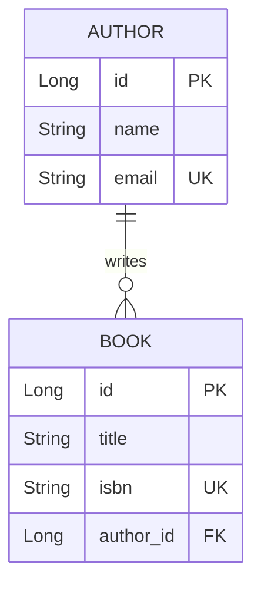

# Spring Boot Library Management Project Report

## 1. Introduction
This document outlines the development of a Spring Boot application designed to manage `Authors` and `Books`. The project utilizes Spring Data JPA for data access, H2 as an in-memory database, and JSP for the view layer.

## 2. Entity Relationship Design
The project features two entities: **Author** and **Book**.
- **Relationship:** One-to-Many (`@OneToMany`). An Author can write multiple Books, but each Book belongs to a specific Author.
- **Attributes (Author):** `id` (Primary Key), `name`, `email` (Unique).
- **Attributes (Book):** `id` (Primary Key), `title`, `isbn` (Unique), `author_id` (Foreign Key referencing Author).

## 3. Implementation Details

### A. Populate Database
Upon application startup, Spring Boot automatically executes `data.sql` located in the `src/main/resources/` directory. This script populates the database with 10 Authors and 10 Books to facilitate immediate testing and demonstration.

### B. Create Operation
- **Controller:** The `AuthorBookController` handles `GET` requests to display the forms (`showNewAuthorForm`, `showNewBookForm`) and `POST` requests to save entities (`saveAuthor`, `saveBook`).
- **JSP View:** The `new_author.jsp` and `new_book.jsp` files provide user-friendly input forms utilizing the Spring Form tag library (`<form:form>`).
- **Exception Handling:** If an integrity violation occurs (e.g., trying to add an Author with an existing email, or a Book with a duplicate ISBN), the service layer catches the exception, and the controller utilizes `RedirectAttributes` to pass an error message back to the UI seamlessly.

**Add Author Form:**

**Add Book Form:**

### C. Read Operation
- **Custom Inner Join Query:** The `BookRepository` implements a custom query to perform an inner join between Book and Author using `@Query("SELECT b FROM Book b JOIN FETCH b.author")`. This efficiently fetches the author details alongside the book.
- **Controller:** The `viewHomePage` method maps to the root URL (`/`) and retrieves both the list of authors and the list of books (utilizing the custom inner join query).
- **JSP View:** The `index.jsp` page uses JSTL (`<c:forEach>`) to display the lists in an organized HTML table.

**Home Page / List View:**

### D. Update Operation
- **Controller:** The application handles `GET` requests matching `/showFormForAuthorUpdate/{id}` to fetch the existing entity details by its ID and bind it to the view. `POST` requests to `/saveAuthor` or `/saveBook` utilize JPA's `save()` method, which performs an update (`UPDATE`) if the primary key exists.
- **JSP View:** `update_author.jsp` and `update_book.jsp` forms populate the existing data into the input fields and contain a hidden field (`<form:hidden>`) to preserve the ID during submission.

**Update Author Form:**

**Update Book Form:**

## 4. Challenges Faced & Solutions

1.  **JSP Configuration with Spring Boot 3+:**
    - *Challenge:* Spring Boot typically favors Thymeleaf; using JSP requires specific configurations and avoiding executable JAR packaging limits (JSP often fails in standard jar packaging).
    - *Solution:* Added `tomcat-embed-jasper` and Jakarta JSTL API dependencies to the `pom.xml`. Also configured `spring.mvc.view.prefix` and `.suffix` in `application.properties`.
2.  **Testing Environment Configuration:**
    - *Challenge:* `BookRepositoryTest` initially failed due to a missing dependency for standard `@SpringBootTest` context loading and `@DataJpaTest` resolution in the updated Spring Boot 3 testing scope.
    - *Solution:* Included the `spring-boot-starter-test` dependency in the `pom.xml` and adjusted the test annotations to leverage the `@SpringBootTest` context, successfully allowing the database tests to pass.

## 5. Github URL
- The project has been committed to a local Git repository.
- To push to a remote server, create an empty repository on GitHub and execute:
  `git remote add origin <YOUR_GITHUB_URL>`
  `git push -u origin main`
